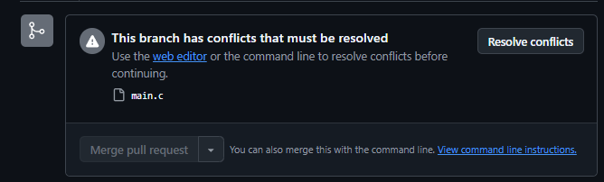
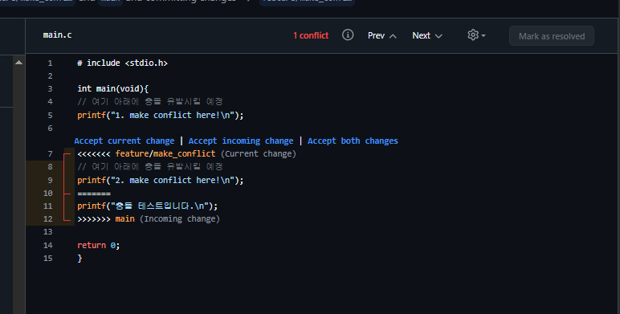
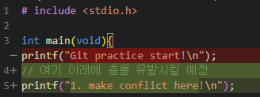
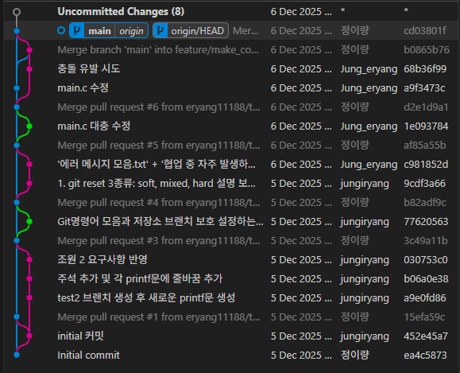
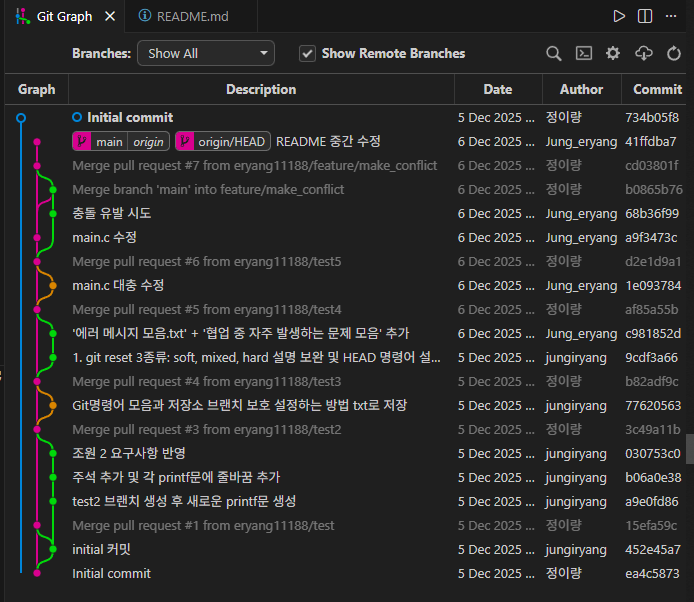
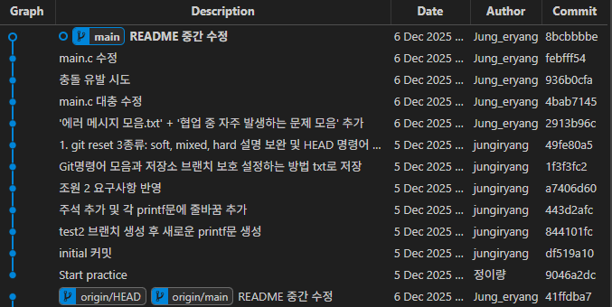
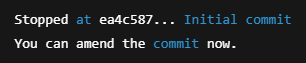

**마지막 수정: 12/6 11:19pm**
# Github 연습 일지

## 목표
### 1단계: GitHub 구조 및 작동 원리 등 기초 숙달
- **초기 세팅:** 원격 저장소 생성과 초기 작업 폴더 지정 등 기초적인 준비 해보기
- **브랜치 관리:** 여러 브랜치를 생성 후 main에 PR로 `merge` 해보기
    - .gitignore 사용 해보기
- **Pull Request:** 사용 및 충돌 해결 해보기
- **markdown 문법 숙달:** 연습하면서 주기적으로 README.md 작성 또는 코멘트 남겨서 `markdown` 문법에 익숙해지기

### 2단계: Git명령어 사용 숙달 및 자주 뜨는 에러 메시지 해석 
- 예시:
   - non-fast-foward 원인 분석과 해결하기
      - **_! [rejected]        main -> main (non-fast-forward)_**
   - 
   -  


# 12/6(토) 기록
## 1. 충돌 유발 성공 및 해결
### 1-1. 개요

- 이전에 `main.c`에 한 줄을 수정하고 `main브랜치`에 `PR`을 하여 충돌을 유발하려 했으나 실패  
   >  왜냐하면 그 한 줄에 있던 코드를 지우고 그냥 새로운 코드를 썼음
1. 따라서 이번에는 `main 브랜치에서`  코드 수정 후 원격에 push, 그 후에 `충돌 유발 브랜치`에서 코드수정 후 push
2. 그 후에 `main 브랜치`에 `PR` 시도
3. 충돌 유발 성공


---

|▼충돌 유발|▼충돌 해결 과정|
|:---:|:---|
|||
|테스트(가운데 정렬)|테스트2(왼쪽 정렬)|

---
### 1-2. 첫번째 `printf`문에서는 충돌 안 난 이유?
- 내가 `충돌 유발 브랜치`에서 원래 main.c에 있던 `printf("Git practice start!\n");` 이거를 지우고 `printf("1. make conflict here!\n");` 이렇게 바꿨기 때문 

#### 예시:
```c
printf("Git practice start!\n"); // 이거를 지우고
```
```c
printf("1. make conflict here!\n");  // 이걸로 바꿨기 때문
```
**즉, 원래 있던 코드를 자연스럽게 삭제하고 바꾼 거라 당연히 충돌이 안 일어남**
- **스크린샷 예시로 설명**:

     


---

### 1-3. 배운 점:

- `충돌 유발 브랜치`에서 생성한 `printf`문 선택하여 `conflict` 해결
   - **충돌 해결 과정 스크린샷 설명:**
     - <<<< 이거는 여기 아래에 오는 코드는 compare(병합할 브랜치)의 코드 표시임 <br> `feature/make_conflict`
     -  ========= 이거는 경계션 표시
     - \>>>> 이거는 여기 위에 오는 코드는  base(병합을 당할 브랜치)의 코드 표시임 <br>  `origin/main`

- `markdown` 문법 조금 숙달
   -   이미지를 표 테이블에 삽입하는 방법과 테이블 정렬 방식도 새로 배움
---

> _Originally posted by @eryang11188 in https://github.com/eryang11188/Github-practice-repository/issues/7#issuecomment-3619968412_


---

## 2. 히스토리 재작성 시도 & 실패 후 사고 복구
### 2-1. 개요
초기 `main` 브랜치의 **_initial commit_**  `README.md` 내용을 너무 대충 지은 거 같아서 마음에 안 들었음. `main`의 **_initial commit_** 으로 가서 **README.md**의 내용을 바꾸고 싶었음. 그러기 위해서는 `main`의 최초 커밋을 수정해야 했음
 

 **_초기 README.md ▼_**


### 2-2. 문제 발생
 이 과정에서 `git rebase -i --root` 명령을 사용했고, 그 결과 main 브랜치의 히스토리가 완전히 재작성되며 지금까지 내가 연습한 `PR`의 기록이 모두 삭제되며 `main` 브랜치가 일직선 구조로 바뀌고, 기존의 `main` 브랜치는 **_detached**_ 상태가 되어버림

|**1. 초기 브랜치 상태▼**|**2. `rebase -i --root` 후▼**|  **3. `git rebase --continue`후 detached 상태의 새 `main`브랜치▼**   |
|:---:|:---:|:---:|
||||


### 2-3. 문제 과정
- main의 **최초 커밋 내용만** 바꾸고 싶었다.
- 그러나 main 브랜치의 **기존 히스토리와 merge 기록은 유지하고 싶었다.**

알고보니까 이 두 조건은 Git 구조상 **동시에 충족할 수 없는 조건**이었다. 


1. `git rebase -i --root` 실행<br>

- **실행결과▼**
 
   
> ammend 명령어로 수정 가능하다는 의미

---
      


2. 초기 커밋을 덮어쓰기 위해, <br>
`git commit --amend` 실행
---

3. 그 후 다음 커밋으로 넘어가면서 차례차례 모든 커밋들을 새로운 히스토리에 맞추기 위해, <br>`git rebase --continue` 실행


   - 결국 `main` 브랜치의 히스토리가 **linear**한 구조로 바뀌어 버리고, 기존의 `main` 브랜치는 **_detached_** 상태가 되어버림
       - 스크린샷: 

---


### 2-4. 왜 `merge` 기록이 사라졌는가?

- **merge commit**은 부모가 2개인 특별한 구조임
    ```scss
   (merge commit)
        ├─ Parent 1
        └─ Parent 2
    ```

- 그런데 rebase를 하면 히스토리를 한 줄로 바꾸어 버림<br>
  - 따라서 merge commit을 재현할 수가 없게 되므로, 자동으로 삭제가 되버림

**_이것이 GitGraph에서 `merge`기록이 사라진 이유!_**

---

### 2-5. 왜 기존의 `main`이 deatached 되었는가?
- **HEAD**포인터는 `rebase`로 새로 만든 main을 가르키므로, 이전의 `main` 브랜치는 **detached가 된다.

> 이것이 rebase --root의 동작 과정

---
### 2-6.복구 시도
내 목표는 원래 기존의 `main`에서 **_initial commit_**만 수정하는건데, 의도치 않게 PR기록과 `main`이 **detached** 상태가 되어버림.

### 따라서 원래 `main`을 되돌리기 위해서는:
1. **detached 상태가 된 원래 `main`의 커밋 해시를 통해 백업 브랜치 생성
2. `main`을 reset
3. `--force push`로 원격과 동기화
> 이런 복잡한 절차가 필요했음

#### 따라서 `git clone` 을 다시하여 가장 깔끔하고 안전한 방법 선택

### 2-7 배운점:
1. **initial commit**을 직접 수정하는 것은 히스토리 전체 재작성이다

2. **`merge`** 기록을 유지하면서 내용만 바꾸고 싶다면?<br>
    - 초기 커밋 다음에 “수정 커밋”을 만드는 방식이 유일한 해법
        - `git revert` 사용 
        - 혹은 그냥 다음 commit으로 대체


3. **`rebase`** 명령어는 매우 강력하지만 위험

4. `main`은 절대 직접 수정하지 않고, 모든 기능은 브랜치에서 작업후 `main`에 `merge`하기!

5. 로컬에서 Git이 크게 꼬였을 때 최고 복구법은 그냥  `git clone` 하자
    - 시간 절약 + 스트레스 감소.

---

## 다음 목표
- 2학년 1학기, 2학년 2학기 때 코드 실습한 것 ex) `c`, `java`, `html,css,js` , `sqlquerry` 등 아무거나 하나 골라서 기록처럼 남겨보기
- markdown 문법에 익숙해지기
   - `html` 태그가 markdown에도 적용이 됨 ex) `<br>` , `<p>` 등<br>따라서 시간 남으면 기초적인 `html` 태그도 다시 복습하기 (**_2-1학기 웹프로그래밍 과목_**)
- **GitHub** 계정 부캐 하나 파서 **_PR_** 시 **_reviewers_** 에 부캐 추가하고 승인 받는 거 해보기
- `.gitignore` 추가 후 사용해보기


          